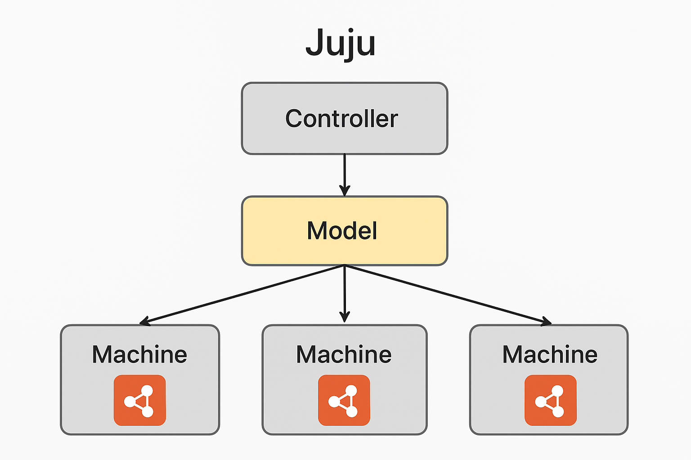

# Juju

Juju ဆိုတာ Cloud Infrastructure တွေကို စီမံခန့်ခွဲရာမှာ Server တွေကို တစ်လုံးချင်း configuration လိုက်လုပ်နေမယ့်အစား **Application** တွေအချင်းချင်း ဘယ်လိုချိတ်ဆက်အလုပ်လုပ်မလဲဆိုတဲ့ **Model** ကိုအဓိကထားပြီး စီမံခန့်ခွဲတဲ့ Tool တစ်ခုဖြစ်ပါတယ်။

DevOps လောကမှာ ဒါကို **Model-driven Operations** လို့ ခေါ်ပါတယ်။ Juju ရဲ့ အဓိက ရည်ရွယ်ချက်ကတော့ Cloud အမျိုးမျိုး (AWS, Azure, Google Cloud, OpenStack, Bare Metal) ပေါ်မှာ ရှုပ်ထွေးတဲ့ Software တွေကို လွယ်ကူစွာ Deploy လုပ်နိုင်ဖို့နဲ့ ပြုပြင်ထိန်းသိမ်းနိုင်ဖို့ ဖြစ်ပါတယ်။

Juju ရဲ့ လုပ်ဆောင်ပုံသဘောတရားကို ပိုမိုရှင်းလင်းသွားအောင် ဒီပုံလေးကို ကြည့်လိုက်ရအောင်။

Juju ရဲ့ "Nitty-Gritty" (အတွင်းပိုင်း အသေးစိတ်အလုပ်လုပ်ပုံ) ကို နားလည်ဖို့ဆိုရင် အဓိကကျတဲ့ အစိတ်အပိုင်းတွေကို ခွဲခြမ်းစိတ်ဖြာကြည့်ဖို့ လိုပါလိမ့်မယ်။ အောက်ပါ အပိုင်း (၃) ပိုင်းပါ။

1.  **Juju Architecture (Controller & Agents):** Juju Controller က ဘယ်လို အလုပ်လုပ်သလဲ၊ Database (MongoDB) ကို ဘယ်လိုသုံးထားသလဲ၊ Machine တစ်ခုချင်းစီမှာရှိတဲ့ Agent တွေက Controller နဲ့ ဘယ်လို ဆက်သွယ်သလဲဆိုတဲ့ Infrastructure ပိုင်း။
2.  **Charms & Hooks (The Logic):** Application တစ်ခုကို run ဖို့အတွက် ရေးသားထားတဲ့ Code (Charm) တွေအကြောင်း။ `install`, `config-changed`, `upgrade-charm` စတဲ့ Hook တွေက ဘယ်အချိန်မှာ trigger ဖြစ်သလဲဆိုတဲ့ Programming ပိုင်း။
3.  **Relations & Integration (The Wiring):** Application နှစ်ခု (ဥပမာ - Web Server နဲ့ Database) ချိတ်ဆက်တဲ့အခါ IP address တွေ၊ Password တွေကို လူက ဝင်ပြင်စရာမလိုဘဲ Juju က `relation-joined`, `relation-changed` စတဲ့ event တွေနဲ့ ဘယ်လို အလိုအလျောက် Handshake လုပ်သွားသလဲဆိုတဲ့ အပိုင်း။
